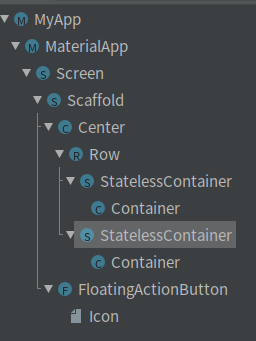
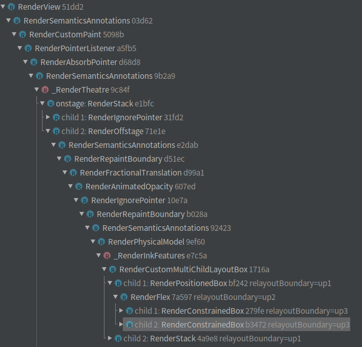
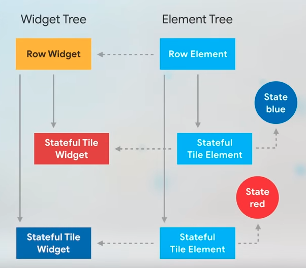

# Flutter学习笔记：Key的作用

&emsp;&emsp;Flutter 框架中 Widget 构造函数都提供了Key 作为可选参数。

```dart
abstract class StatelessWidget extends Widget {
  /// Initializes [key] for subclasses.
  const StatelessWidget({ Key key }) : super(key: key);
```
```dart
abstract class StatefulWidget extends Widget {
  /// Initializes [key] for subclasses.
  const StatefulWidget({ Key key }) : super(key: key);
```
&emsp;&emsp;Key 是一个比较难以理解的概念，官方指导视频[When to Use Keys - 
Flutter Widgets 101 Ep. 4](https://www.youtube.com/watch?v=kn0EOS-ZiIc)
对此做了简要的介绍。

&emsp;&emsp;但是，在看过这个视频之后，部分同学的主要疑问在于，例子中为什么
StatefulWidget必须要使用Key才能更换颜色，而StateleesWidget不需要。

> Talk is cheap, show me the code.

&emsp;&emsp;对于这个问题，我们需要跟踪源码获得更准确的答案。

## 问题复述

&emsp;&emsp;Demo 视频中建立了一个 Widget tree， 包含两个随机颜色的色块。
如果是 StatelessWidget 构建的Widget，点击按钮就可以调换顺序；
但是如果是StatefulWidget，就不能更换颜色。
为了解决这个问题，我们可以在StatefulWidget构造时传入一个UniqueKey，
就可以使得Demo中颜色发生变化。

Demo 代码路径： [flutter_keys](../../lib/flutter_keys/flutter_keys.dart)

## 问题分析

&emsp;&emsp;理解这个问题的为什么会发生，需要有一些 Flutter framework 的基础知识。

### Widget Tree， Element Tree 和 Render Tree

&emsp;&emsp;Flutter framework 维护了三棵树来描述应用程序的UI；

- Widget Tree 

  由 Widget 组成的配置树，提供给开发人员作为描述UI结构的编程接口，是一个轻量级
  的树。例如案例中的 Widget Tree可以描述为：
  
  

- Render Tree, 

  由RenderObject生成的树，每一个 RenderObject 都包含了 layout, paint, hitTest
  等功能，具备实际的布局，绘制，按键检测等功能，是一个重量级的树。Demo中对应的 Render Tree 为
  
  

- Element Tree, 

  为了便于开发人员更好的控制Render Tree, 介于 Widget Tree, 和 Render Tree之间，
  Flutter Framework 生成了 Element Tree。 Element Tree 由 Widget提供的配置信息生成。 
  
### 树的生成和刷新

&emsp;&emsp;在Flutter 应用第一次启动的时候，attachRootWidget 方法生成了这三棵树。

```dart
void runApp(Widget app) {
  WidgetsFlutterBinding.ensureInitialized()
    ..attachRootWidget(app)
    ..scheduleWarmUpFrame();
}
```

&emsp;&emsp;在用户点击按钮时，我们通过SetState() 设置相关element节点状态为dirty, 从而在下一个vsync信号
到来时触发控件树的刷新。
```dart
  switchWidget() {
    widgets.insert(0, widgets.removeAt(1));
    setState(() {});
  }
```

```dart
  @protected
  void setState(VoidCallback fn) {
    ......
    _element.markNeedsBuild();
  }
```

### StatelessWidget element 的生成

&emsp;&emsp;StatelessWidget 会生成 StatelessElement：
```dart
abstract class StatelessWidget extends Widget {
  /// Creates a [StatelessElement] to manage this widget's location in the tree.
  @override
  StatelessElement createElement() => StatelessElement(this);
```

&emsp;&emsp;StatelessElement 在执行update 操作时，rebuild() 最终会调用到 build()方法从而直接
重建一个Widget.

&emsp;&emsp;可以看到 StatelessElement，仅持有一个对Widget的引用。

```dart
/// An [Element] that uses a [StatelessWidget] as its configuration.
class StatelessElement extends ComponentElement {
  /// Creates an element that uses the given widget as its configuration.
  StatelessElement(StatelessWidget widget) : super(widget);

  @override
  StatelessWidget get widget => super.widget;

  @override
  Widget build() => widget.build(this);

  @override
  void update(StatelessWidget newWidget) {
    super.update(newWidget);
    assert(widget == newWidget);
    _dirty = true;
    rebuild();
  }
}

```

### StatefulWidget element 的生成
&emsp;&emsp;相应的，StatefulWidget 会生成 StatefulElement，此Element除了持有一个widget引用，
还持有了一个State的引用，新建element的时候保存在 _state 变量中。

```dart
class StatefulElement extends ComponentElement {
  /// Creates an element that uses the given widget as its configuration.
  StatefulElement(StatefulWidget widget)
      : _state = widget.createState(),
```

&emsp;&emsp;用户点击了按钮，触发了element tree 的刷新后，调用StatefulElement.update进行更新。
但是，StatefulElement此时仅更新了widget的引用，没有更新state。
```dart
  @override
  void update(StatefulWidget newWidget) {
    ......
    _state._widget = widget;
```
&emsp;&emsp;因此，Element.rebuid 最终会调用到我们定义的_StatefulContainerState.build中时，
color 还是之前的值，并没有变化。

&emsp;&emsp;因为**_state没有更新，还是StatefulElement构造时使用的那个**。
  
## 问题解决方案：使用 Key 标记 Element
  
&emsp;&emsp;Flutter 提出解决 StatefulElement 如何更新 state 的方案，
就是使用 Key 标记 Element。发现 Key 不相同时重新刷新Element。
  
### Element Tree 触发更新过程：

&emsp;&emsp;Key 方案是如何生效的？首先我们回顾上面 Element Tree更新的过程

  - 从根结点开始，Element.updateChild
  
  - 深度遍历到Row节点， child 是 StatefulContainer
  
  - 判断 Widget.canUpdate(child.widget, newWidget) 是true，可以执行更新
  
    这里 child.widget 是变化之前的 StatefulContainer， newWidget 是新的StatefulContainer；
  
  - 由于上一步判断可以更新，因此执行 child.update(newWidget);也就是 StatefulElement.update
  
  - StatefulElement.update的时候，仅更新了widget的引用，没有更新state，导致颜色没有变化。
  
```dart
  @override
  void update(StatefulWidget newWidget) {
    ......
    _state._widget = widget;
```

  &emsp;&emsp;因此，解决方案的关键在于 Widget.canUpdate 需要返回 false。
  
```dart
  static bool canUpdate(Widget oldWidget, Widget newWidget) {
    return oldWidget.runtimeType == newWidget.runtimeType
        && oldWidget.key == newWidget.key;
  }
```
  &emsp;&emsp;为此Flutter设计人员设计了这个方法：当我们给 StatefulContainer 
设置 Key 时，Widget.canUpdate 返回 false。 原有的Element会被暂时deactive，在需要
时重新mount到树上。从而保证 StatefulWidget 状态可更新，而且状态不丢失。


## 总结



&emsp;&emsp;啰嗦了这么多，其实就是为了解释视频中的这张图，Key 就是为了解决图中widget
更新而state没有更新导致的问题而出现的。

&emsp;&emsp;限于篇幅，本文仅分析了不使用Key导致state和widget对应错误的问题。
还有一种场景是，使用了key，但是导致State被重新创建从而丢失信息。这就是Key的作用域的问题。
对应的解决方案就是 GloableKey，留作后续分析。
