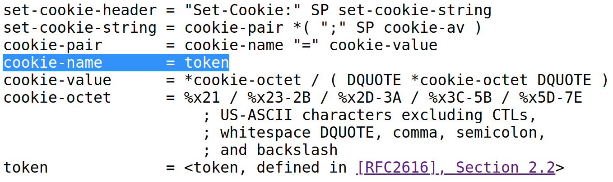
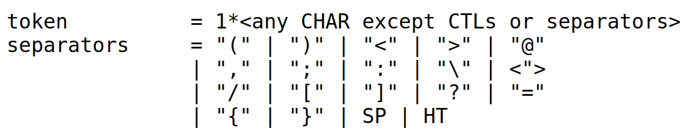

# Flutter填坑笔记： dio报错 FormatException

&emsp;&emsp;以前说到， Dart 是个年轻的语言，SDK 还不够成熟，使用中有很多坑。之前解决
了一个使用代理导致空指针的问题，这次又碰上了一个使用 Cookie 产生 FormatException 的问题。

## 问题描述

&emsp;&emsp; dio是Flutter中文网开源的一个强大的Dart Http请求库，我使用这个库写了
一个访问网站 Login 接口的 Demo。

```dart
  Dio client = new Dio(options);
  client.interceptors.add(CookieManager(CookieJar()));
  
  FormData formData = new FormData.from(
      {"id": 123456, "passwd": 456789, "CookieDate": "2"});
  
  var response = await client.post<String>(
      "/path/to/login.json",
      data: formData,
  );
```

代码很简单：
- 使用 dio 发起一个 Post 请求，包含用户名和密码，调用 web login 接口；
- 服务器response 包含 set-cookie 设置登录信息; 后续访问需要携带 cookie.
- 客户端使用 CookieManager(CookieJar()) 保存 cookie信息。

然而很不幸，简单的代码遇上了如下错误：

> DioError [DioErrorType.DEFAULT]: FormatException: Invalid character in cookie name, code unit: '91' (at character 5)
main[UTMPUSERID]


抓出服务器响应分析：
> set-cookie: main[UTMPUSERID]=guest; path=/; domain=.****.net

> set-cookie: main[UTMPKEY]=48990095; path=/; domain=.****.net

> set-cookie: main[UTMPNUM]=79117; path=/; domain=.****.net

set-cookie 字段包含了非法字符"["和"]"，导致请求失败。

&emsp;&emsp;问题已经定位，请服务器兄弟吃顿烧烤，改一下 set-cookie 字符串定义，问题解决。 ^_^

&emsp;&emsp;但是作为一个有追求的程序员，不能不跟踪一下根本原因。

## 问题定位

### 协议中关于 set-cookie 的规定

&emsp;&emsp; HTTP 协议中，关于 set-cookie 可以使用的字符有明确规定：

[RFC6265](https://tools.ietf.org/html/rfc6265#section-4.1) 中规定 cookie-name
是一个 token。



[RFC2616](https://tools.ietf.org/html/rfc2616#section-2.2) 中定义了 token 就是
CHAR 排除掉分割符，因此"["和"]"确实是协议规定的非法字符。



&emsp;&emsp; 貌似烧烤白请了 T_T，但是协议规定和现实有很大的距离。

[StackOverFlow](https://stackoverflow.com/questions/1969232/allowed-characters-in-cookies)
这篇回答解释了 set-cookie 合法字符的变化历史，简单来说，RFC6265协议定义了最新的标准，
新的网络接口都应该符合这个标准。但是有大量的历史遗留问题，很多网站采用的就是最原始的 Netscape cookie_spec。
因此，从实际角度出发，服务器端新增接口都要符合RFC6265，而客户端最好能向前兼容历史标准。

### Dart SDK 中的处理

&emsp;&emsp;回到Flutter代码中，Dio 通过 CookieManager 作为Intercepter 拦截所有
请求和响应，如果响应有set-cookie，就保存在CookieJar中；发起请求时从CookieJar获取当前
Coockie。

```dart
  dio/lib/src/interceptors/cookie_mgr.dart
  
  _saveCookies(Response response) {
    ......
        cookieJar.saveFromResponse(
          response.request.uri,
          cookies.map((str) => Cookie.fromSetCookieValue(str)).toList(),
        );
    ......
  }
```

因此，判断Cookie字段是否合法，代码包含在 Dart SDK => Cookie.fromSetCookieValue 中：

```dart
dart-sdk/lib/_http/http_headers.dart

  void _validate() {
    const separators = const [
      "(",
      ")",
      "<",
      ">",
      "@",
      ",",
      ";",
      ":",
      "\\",
      '"',
      "/",
      "[",
      "]",
      "?",
      "=",
      "{",
      "}"
    ];
    for (int i = 0; i < name.length; i++) {
      int codeUnit = name.codeUnits[i];
      if (codeUnit <= 32 ||
          codeUnit >= 127 ||
          separators.indexOf(name[i]) >= 0) {
        throw new FormatException(
            "Invalid character in cookie name, code unit: '$codeUnit'",
            name,
            i);
      }
    }

    // Per RFC 6265, consider surrounding "" as part of the value, but otherwise
    // double quotes are not allowed.
    int start = 0;
    int end = value.length;
    if (2 <= value.length &&
        value.codeUnits[start] == 0x22 &&
        value.codeUnits[end - 1] == 0x22) {
      start++;
      end--;
    }

    for (int i = start; i < end; i++) {
      int codeUnit = value.codeUnits[i];
      if (!(codeUnit == 0x21 ||
          (codeUnit >= 0x23 && codeUnit <= 0x2B) ||
          (codeUnit >= 0x2D && codeUnit <= 0x3A) ||
          (codeUnit >= 0x3C && codeUnit <= 0x5B) ||
          (codeUnit >= 0x5D && codeUnit <= 0x7E))) {
        throw new FormatException(
            "Invalid character in cookie value, code unit: '$codeUnit'",
            value,
            i);
      }
    }
  }
```

- 从上面代码我们可以看出，Dart SDK 严格实现了 RFC6265 标准， 
- "(",")","<",">","@",",",";",":","\\",'"',"/","\[","\]","?","=","{","}"
都是非法字符。
- 注意，Dart 2.1 之前的版本 cookie name 前后如果有双引号，也会被判断为非法字符，
后来提了 [patch](https://github.com/dart-lang/sdk/commit/a9ad427ea22ad81c9a06c4c35c04c1ab029c08df) 才修正。

### 终端规避方案

&emsp;&emsp;由于服务器代码祖传，无法修改。我们在客户端作兼容，兼容的方法就是，不使用
Dart SDK 提供的 Cookie，使用我们自定义的 Cookie。这样我们可以自定义客户端的合法字符。

Dio 建立自定义的CookieManager， PrivateCookieManager代码在 [这个路径](https://github.com/lixiangthinker/flutter_docs/blob/master/lib/dio_cookies/private_cookie_manager.dart) 。

```dart
client.interceptors.add(PrivateCookieManager(CookieJar()));
......
class PrivateCookieManager extends CookieManager {
  ......
        cookieJar.saveFromResponse(
          response.request.uri,
          cookies.map((str) => _Cookie.fromSetCookieValue(str)).toList(),
        );
  ......
}

class _Cookie implements Cookie {
  void _validate() {
    const separators = const [
      "(",
      ")",
      "<",
      ">",
      "@",
      ",",
      ";",
      ":",
      "\\",
      '"',
      "/",
//******* [] is valid in this application ***********      
//      "[",
//      "]",
      "?",
      "=",
      "{",
      "}"
    ];
  }
}
```
## 问题总结

&emsp;&emsp;跟踪下来，Dart SDK的处理没有问题，符合协议要求。只是处理的灰度不够，
毕竟现在有大量的服务器应用还是采用的原有定义。Cookie中的_validate是一个私有方法，
如果能暴露出来可以继承修改，冗余代码量会少很多。
