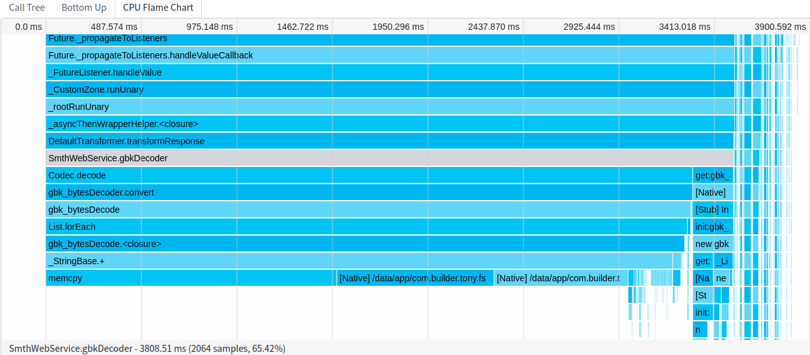
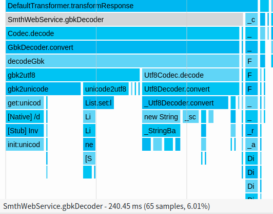
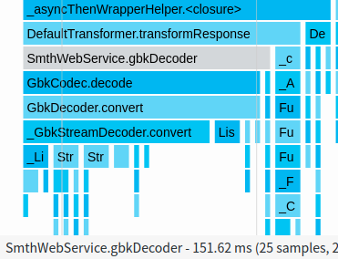

# Dart： 开源了一个支持 stream 接口的 GBK codec, fast_gbk

&emsp;&emsp;Dart 原生SDK默认支持UTF-8编码，无论是File 还是HttpClient接口，默认提供的encoding 都是utf-8。

&emsp;&emsp;例如，file.dart 中，openWrite方法默认encoding就是utf8，这样生成的文件默认就是utf-8编码的。
```dart
  //file.dart
  IOSink openWrite({FileMode mode: FileMode.write, Encoding encoding: utf8});
```

&emsp;&emsp;本文提供了一个gbk codec, 兼容原生APId的stream接口，读写文件和Http的 Stream API更为方便。

例如，使用stream api 生成一个gbk文件流程如下：

```dart
import 'dart:io';
import 'package:fast_gbk/fast_gbk.dart';
void main() async {
  File output = File("gbk.txt");
  var stream = output.openWrite(encoding: gbk);
  stream.write("123");
  stream.writeln("456");
  stream.writeCharCode(0x41);
  await stream.close();
}
```

## 使用方法
- 添加依赖

pubspec.yaml 中添加依赖
> dependencies:
>   fast_gbk: ^0.1.1

- 更新pubcache
> flutter pub get

- dart文件中添加引用 
> import 'package:fast_gbk/fast_gbk.dart';

## Demo

- 最简单的使用场景，直接编码解码String:

```dart
import 'package:fast_gbk/fast_gbk.dart';
void main() async {
  var encoded = gbk.encode("白日依山尽，黄河入海流");
  var decoded = gbk.decode([176, 215, 200, 213, 210, 192, 201, 189, 190, 161, 163,
                            172, 187, 198, 186, 211, 200, 235, 186, 163, 193, 247]);
}
```

- 读GBK编码的文件

```dart
import 'dart:convert';
import 'dart:io';
import 'package:fast_gbk/fast_gbk.dart';
void main() {
  File gbkFile = File("gbkFile.txt");
  var stream = gbkFile.openRead();
  stream.transform(gbk.decoder)
      .transform(const LineSplitter())
      .listen((line) {
    stdout.writeln(line);
  });
}

```

- 写GBK编码的文件
```dart
import 'dart:io';
import 'package:fast_gbk/fast_gbk.dart';
void main() async {
  File output = File("gbk.txt");
  var stream = output.openWrite(encoding: gbk);
  stream.write("123");
  stream.writeln("456");
  stream.writeCharCode(0x41);
  await stream.close();
}
```

- 解码GBK的 HttpClient response

```dart
import 'dart:io';
import 'package:fast_gbk/fast_gbk.dart';
void main() async {
  var gbkWebUrl = "http://www.newsmth.net/nForum/#!mainpage";
  var httpClient = HttpClient();
  HttpClientRequest request = await httpClient.getUrl(Uri.parse(gbkWebUrl));
  HttpClientResponse response = await request.close();
  var responseBody = await response.transform(gbk.decoder).join();
  print(responseBody);
  httpClient.close();
}
```
- DIO 中使用 Gbk Codec 解码 response: 

options 设定responseDecoder
```dart
      BaseOptions options = BaseOptions();
      options.responseDecoder = gbkDecoder;
      _client = Dio(options);
```

定义gbk Decoder
```dart
  String gbkDecoder (List<int> responseBytes, RequestOptions options,
      ResponseBody responseBody) {
    String result =  gbk.decode(responseBytes);
    return result;
  }
```

## Q&A

- Q：又造了一个轮子？和现有的gbk codec有什么区别？

- A：现有的gbk_codec和gbk2utf8都可以支持encode和decode接口，但不支持Stream接口。

在效率方面，本文作者在使用 gbk_codec 和 gbk2utf8 解析HttpResponse时都产生了卡顿，因此才重写了这个模块：

gbk_codec 在解码时大量使用了 String+= 拼接字符，使得界面刷新产生了卡顿，如下火焰图显示刷新界面主页时解码耗时了3.8s：



gbk2utf8 的效率略高，同样界面耗费240ms, 跟踪发现gbk解码时先转为unicode, 然后unicode转为utf8, utf8再转为String。

实际上，Dart String就是按照UTF-16编码实现的，支持unicode。gbk2utf8实际上浪费了一半的解码时间，因此效率不高。



fast_gbk 测试结果如下，同样界面耗时150ms，是三个codec中解码最快速的，界面明显不再卡顿。



由于fast_gbk支持Stream接口，在大量数据编解码时比直接encode，decode效率会更高些，使用也更方便。

- Q：稳定么？有没有bug？

- A：目前测试用例已经覆盖了所有utf-8字符和GBK字符，如果发现有bug，代码已经在Github上开源，欢迎提交 [issue](https://github.com/lixiangthinker/fast_gbk/issues) 
和 [pull request](https://github.com/lixiangthinker/fast_gbk/pulls)。pub链接为：
[pub.dev](https://pub.dev/packages/fast_gbk#-installing-tab-)